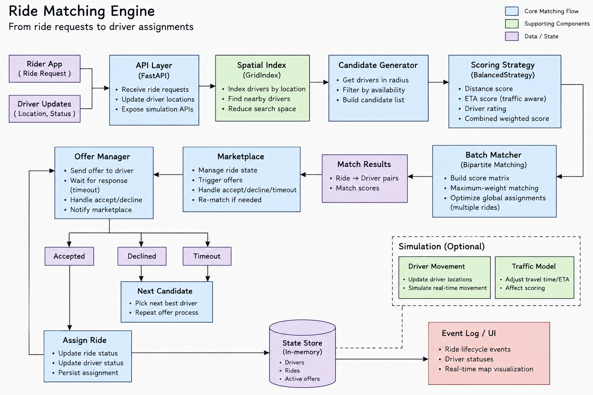

# Ride Matching Engine

A real-time ride dispatch engine built to explore the algorithmic and system-design problems behind ride-hailing platforms.

Instead of treating ride matching as a simple "find the nearest driver" problem, this project models the dispatch flow — from spatial candidate discovery and scoring to driver offers, acceptance, rejection, timeout, and rematching.

> Inspired by real-world ride-hailing systems. This project does not attempt to reproduce any proprietary Uber/Lyft algorithms.

---

## Demo

### Live Ride Matching Simulation

[Watch the Ride Matching Engine Demo](docs/demo.mp4)

The demo shows:

- Driver movement in a simulated environment
- Spatial candidate generation
- Multi-factor driver scoring
- Driver offer lifecycle
- Offer rejection and rematching
- Offer timeout and rematching
- Driver acceptance
- Final ride assignment

---

## Architecture



The system follows this general flow:

```text
Ride Request
     ↓
Candidate Generation
     ↓
Distance Filtering
     ↓
Driver Scoring
     ↓
Ranked Candidates
     ↓
Driver Offer
     ↓
Accept / Decline / Timeout
     ↓
Assignment / Rematching
