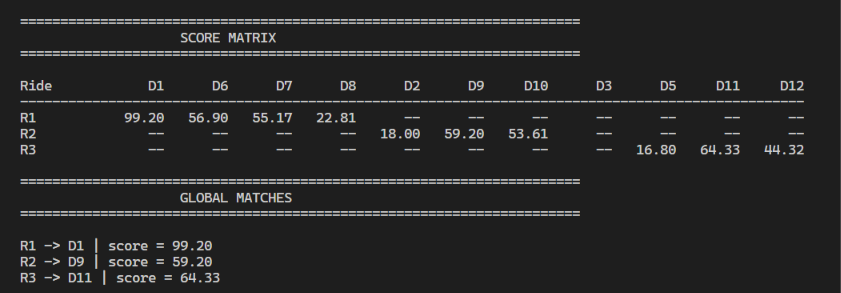

# Ride Matching Engine

A real-time ride dispatch engine built to explore the algorithmic and system-design problems behind ride-hailing platforms.

Instead of treating ride matching as a simple "find the nearest driver" problem, this project models the dispatch flow — from spatial candidate discovery and scoring to driver offers, acceptance, rejection, timeout, and rematching.

> Inspired by real-world ride-hailing systems. This project does not attempt to reproduce any proprietary Uber/Lyft algorithms.

---

## Demo

### Live Ride Matching Simulation

[Watch the Ride Matching Engine Demo](docs/demo.mp4)

The demo shows:

- Driver movement in a simulated environment
- Spatial candidate generation
- Multi-factor driver scoring
- Driver offer lifecycle
- Offer rejection and rematching
- Offer timeout and rematching
- Driver acceptance
- Final ride assignment

---

## Architecture


The system follows this general flow:

```text
Ride Request
     ↓
Candidate Generation
     ↓
Distance Filtering
     ↓
Driver Scoring
     ↓
Ranked Candidates
     ↓
Driver Offer
     ↓
Accept / Decline / Timeout
     ↓
Assignment / Rematching
```

---

## Score Matrix

For multiple simultaneous ride requests, the system builds a score matrix representing the suitability of each driver for each ride.



The matrix represents the matching score between each ride and available driver. Higher scores indicate a better match according to the configured scoring strategy.

The score matrix can then be processed using bipartite maximum-weight matching to determine assignments across multiple rides and drivers.

---

## Key Features

### 1. Spatial Driver Indexing

A grid-based spatial index reduces the number of drivers that need to be checked when a ride request arrives.

Instead of calculating the distance to every driver, the system first retrieves drivers from nearby grid cells and then performs exact distance filtering.

### 2. Candidate Generation

Drivers are filtered based on:

- Driver availability
- Pickup radius
- Actual distance from the rider

Only valid nearby drivers proceed to the scoring stage.

### 3. Multi-Factor Matching

Drivers are ranked using a weighted scoring strategy based on:

- Pickup distance
- Estimated arrival time
- Driver rating

The scoring logic uses the Strategy Pattern, allowing different matching strategies to be plugged into the matching engine.

### 4. Stateful Driver Offers

Matching a driver does not immediately assign the ride.

The selected driver receives an offer and can:

- Accept
- Decline
- Let the offer timeout

This separates candidate matching from the actual ride assignment.

### 5. Automatic Rematching

If a driver declines or an offer expires, the system automatically moves to the next eligible candidate.

```text
Ride Request
     ↓
Rank Candidates
     ↓
Send Offer
     ↓
 ┌───────────────┐
 │               │
Accept       Decline / Timeout
 │               │
 ↓               ↓
Assigned      Next Candidate
                 ↓
              New Offer
```

### 6. Batch Matching

For multiple simultaneous ride requests, the system can construct a ride-driver score matrix and use bipartite maximum-weight matching to determine assignments across the batch.

### 7. Driver Movement & Traffic Simulation

Drivers move through the simulated environment while traffic conditions can affect their effective speed and therefore their matching score.

---

## Matching Flow

```text
                Ride Request
                     │
                     ▼
             Candidate Generator
                     │
                     ▼
              Spatial Grid Index
                     │
                     ▼
             Distance Filtering
                     │
                     ▼
              Scoring Strategy
                     │
                     ▼
             Ranked Candidates
                     │
                     ▼
              Driver Offer
                     │
          ┌──────────┼──────────┐
          │          │          │
       Accept     Decline    Timeout
          │          │          │
          ▼          └────┬─────┘
       Assigned          │
                         ▼
                  Next Candidate
                         │
                         ▼
                    New Offer
```

---

## Project Structure

```text
ride-matching-engine/
│
├── backend/
│   ├── api.py
│   ├── main.py
│   │
│   ├── models/
│   │   ├── driver.py
│   │   ├── rider.py
│   │   └── ride.py
│   │
│   ├── matching/
│   │   ├── engine.py
│   │   ├── candidate_generator.py
│   │   ├── strategies.py
│   │   ├── bipartite_matcher.py
│   │   ├── batch_matching.py
│   │   ├── marketplace.py
│   │   ├── offer.py
│   │   └── offer_manager.py
│   │
│   ├── spatial/
│   │   └── grid_index.py
│   │
│   └── simulation/
│       ├── traffic.py
│       └── driver_movement.py
│
├── frontend/
│   ├── package.json
│   └── src/
│       ├── App.jsx
│       └── App.css
│
├── docs/
│   ├── architecture.png
│   ├── demo.mp4
│   └── score_matrix.png
│
├── test_matrix.py
├── .gitignore
└── README.md
```

---

## Tech Stack

### Backend

- Python
- FastAPI
- Object-Oriented Design

### Algorithms & Data Structures

- Spatial Grid Index
- Candidate Generation
- Distance Filtering
- Weighted Scoring
- Strategy Pattern
- Bipartite Maximum-Weight Matching

### Simulation

- Driver Movement
- Traffic Simulation
- Stateful Offer Management

### Frontend

- React
- Vite
- CSS

---

## Running the Project

### Backend

From the project root:

```bash
uvicorn backend.api:app --reload
```

The API will be available at:

```text
http://127.0.0.1:8000
```

### Frontend

Navigate to the frontend:

```bash
cd frontend
npm install
npm run dev
```

---

## Design Decisions

### Why Spatial Indexing?

Checking every available driver for every ride becomes increasingly expensive as the number of drivers grows.

The grid index narrows the search space before exact distance calculations are performed.

### Why Separate Matching from Offers?

A high-scoring driver is not necessarily an immediate assignment.

The driver still needs to respond to the offer, so the system separates:

```text
Matching
   ↓
Offer
   ↓
Driver Response
   ↓
Assignment / Rematching
```

This makes the dispatch process stateful.

### Why Batch Matching?

When multiple rides arrive together, independently choosing the highest-scoring driver for each ride can produce inefficient global assignments.

A score matrix allows the matching process to consider multiple ride-driver combinations simultaneously.

---

## Example Batch Matching

The batch matching component represents multiple ride-driver combinations as a score matrix:

```text
          D1      D2      D3      D4
R1       91.2    87.4    56.1    55.6
R2       63.4    81.2    87.3    44.6
R3       58.4    60.5    44.6    85.1
```

The matching process then considers the overall combination of assignments rather than optimizing each ride independently.

---

## Future Improvements

- Road-network based distance instead of Euclidean distance
- More advanced ETA estimation
- Driver fairness and utilization constraints
- Surge-aware matching
- Dynamic matching radius
- More sophisticated retry and cooldown policies
- Persistent state using Redis or a database
- Distributed dispatch workers

---

## What This Project Demonstrates

This project was built as an exercise in applying software engineering and algorithmic concepts to a realistic backend problem.

It combines:

```text
Spatial Indexing
      +
Candidate Generation
      +
Scoring Strategies
      +
Graph Matching
      +
State Management
      +
Simulation
      +
Real-Time API
```

The main goal was to understand how a seemingly simple feature such as **"Find a Driver"** can involve several algorithmic and state-management problems underneath.

---

## Author

**Manan Andraskar**

GitHub: [@manandev18](https://github.com/manandev18)
